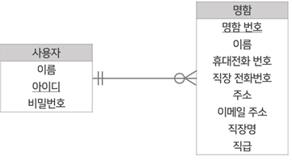
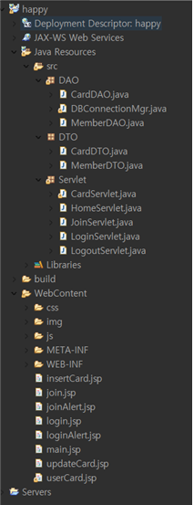
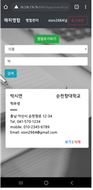

# 해피 명함 관리 시스템

2020 학부 DB프로그래밍 수업 팀 과제

---

## I. DB 설계

### 1. 요구사항 분석

과제 지시사항에 요구사항 목록이 명확하게 지정되어 있지 않아, 저희 조는 다음과 같이 사용자의 요구사항을 설정했습니다.

> **정보 요구사항**

- 명함은 이름, 직장, 직급, 휴대전화 번호, 회사 전화번호, 회사 주소, 개인 이메일 주소를 가질 수 있다.
- 명함은 이름과 휴대전화 번호는 반드시 가져야 한다.
- 사용자는 이름, 아이디, 비밀번호를 갖는다.

> **기능 요구사항**

- 사용자의 가입을 위해 로그인과 회원가입 기능을 가져야 한다.
- 편리한 검색을 위해 이름별, 직장별 상세 검색 기능을 제공해야 한다.
- 명함의 등록 이후, 편집이 가능하도록 명함 수정 및 삭제 기능을 제공해야 한다.
- 모바일/PC 등 웹페이지 사이즈에 상관없이 원활한 열람이 가능하게 하기 위해, 반응형 웹페이지로 작성한다.

### 2. ERD 설계

### 3. 테이블 명세서

---

## II. DB 구축

mySQL로 구축한 DB 정보입니다.

### 1. User 테이블

사용자의 계정 정보를 저장하는 테이블로, 로그인과 회원가입 기능을 통해 접근하게 됩니다.

### 2. Card 테이블

사용자의 명함 정보를 저장하는 테이블로, 명함 등록·수정·삭제 기능을 통해 접근하게 됩니다.

---

## III. 기술 스택

시스템을 설계하면서 개발 도구는 **Eclipse**를 사용하였습니다.
기술 스택은 **JSP/Servlet, JAVA, Javascript, HTML5/CSS3, MySQL**이며, 서버는 **Tomcat**을 사용하였습니다.
웹페이지 디자인을 위해 **Bootstrap**을 사용하였습니다.
또한, **DB 커넥션 풀**은 **iSavvix의 오픈 소스**를 사용 및 수정하여 제작하였습니다.

---

## IV. 중요 소스 코드

### 1. MVC 패턴

1. **Model**
   데이터베이스에서 관리하지만 DAO와 DTO클래스를 이용하여 모델 데이터 관리

2. **View**
   WebContent 안의 jsp 파일들을 이용하여 view를 구현

3. **Controller**
   Servlet 안의 servlet.java 파일들을 이용하여 액션에 대한 처리

### 2. JDBC & Connection Pool 기법 사용

생성과 반환 시간, 접속자 관리, 메모리 관리 면에서 유용한 Connection Pool 기법을 사용했습니다.
Connection Pool은 오픈소스를 가져와서 수정하여 사용하였습니다.
DBConnectionMgr.java에 있는 소스 코드 중 일부입니다.
MySQL을 사용하기 위해서 Connection J를 설치하고 연동해주었습니다.

### 3. DAO & 싱글톤 패턴

모든 DAO 클래스는 메모리 낭비를 방지하여 성능향상을 위해 싱글톤 패턴으로 구성하였습니다.
싱글톤 패턴과 Connection Pool을 같이 사용함으로써 메모리를 효율적으로 사용할 수 있어 성능적 이점을 가지도록 만들었습니다.

### 4. 쿼리

새로운 명함 정보를 데이터베이스에 등록하는 쿼리문입니다.
함수의 동작이 끝나면 커넥션을 반납합니다.

cardDAO에 있는 사용자의 명함 리스트를 반환해주는 함수입니다.
사용자의 명함들을 최신순으로 가져오는 쿼리문입니다.
마찬가지로 함수의 동작이 끝나면 커넥션을 반납합니다.

### 5. Servlet

위 코드는 JoinServlet.java 코드 중 일부입니다.
JSP 페이지에서 요청을 하면, 톰캣의 server.xml에 설정해둔 path(/happy)에 요청url이 붙어서 오기 때문에
각 요청 별로 처리를 할 수 있게 했습니다.
해당 코드는 회원가입 페이지로 넘어가는 동작과 회원가입을 하는 동작을 관리할 수 있게 만들었습니다.

### 6. JSP

위 코드는 login.jsp 코드 중 일부입니다.
form을 통한 서블릿 요청을 보내는 방식입니다.
로그인 버튼을 누르면 ./happy/login과 같이 요청을 보내게 되고 매핑 되어있는 서블릿에서 해당 동작을 처리하게 됩니다.

---

## V. 웹페이지 소개

### 1. 메인 페이지

> **비로그인 상태**

|  |  |
| :-----------------------: | :---------------------------: |
|            PC             |            모바일             |

사이트에 접속하면 가장 먼저 뜨는 메인 페이지입니다.

- 우측 상단의 [로그인] 버튼을 누르면 로그인 페이지로 이동합니다.
- 우측 상단의 [회원가입] 버튼을 누르면 회원가입 페이지로 이동합니다.
- 페이지 가운데의 [시작하기→] 버튼을 누르면 회원가입 페이지로 이동합니다.

모바일 화면에서는 상단바의 공간과 비율을 고려하여 자동으로 Home 탭이 뜨지 않도록 설정하였습니다.

> **로그인 상태**

|  |  |
| :-----------------------: | :---------------------------: |
|            PC             |            모바일             |

로그인 후엔 페이지 가운데에 있던 [시작하기→] 버튼과 우측 상단에 있던 [로그인], [회원가입] 버튼이 사라집니다.
대신 화면 우측 상단에 현재 로그인하고 있는 사용자의 아이디와 [로그아웃] 버튼이 뜨게 됩니다.

- 화면 좌측 상단의 [명함 관리] 탭을 누르면 명함을 등록·수정·삭제·검색하는 명함 관리 페이지로 이동합니다.
- 화면 우측 상단의 [로그아웃] 버튼을 누르면 계정이 로그아웃되고 다시 로그인 전의 메인 페이지로 돌아가게 됩니다.

### 2. 회원가입 페이지

|  |  |
| :-----------------------: | :---------------------------: |
|            PC             |            모바일             |

회원가입 페이지입니다. 이름, 아이디, 비밀번호, 비밀번호 확인란을 작성하는 양식이 나옵니다.
모든 입력란은 필수로 작성해야 합니다.

비밀번호란과 비밀번호 확인란에 입력한
두 비밀번호가 다르면 위와 같이
재입력을 요청하는 알림창이 뜨게 됩니다.

이미 회원으로 등록되어있는 아이디를
입력한 경우에는
위와 같은 알림창이 뜨게 됩니다.

### 3. 로그인 페이지

|  |  |
| :-----------------------: | :---------------------------: |
|            PC             |            모바일             |

로그인 페이지입니다. 아이디와 비밀번호를 입력하는 양식이 나옵니다.
회원가입 시 등록했던 아이디와 비밀번호를 입력하면
데이터베이스에 등록된 사용자 정보와 비교하는 과정을 거쳐 로그인이 됩니다.

등록되지 않은 아이디를 입력할 경우
위와 같은 메시지와 함께 회원가입 페이지로 이동할지 결정하는 알림창이 뜨게 됩니다.

회원가입 시 입력했던 아이디를 입력했지만 비밀번호가 틀릴 경우
위와 같은 메시지와 함께 알림창이 뜨게 됩니다.

### 4. 명함 관리 페이지

> **명함 목록**

|  |  |
| :-----------------------: | :---------------------------: |
|            PC             |            모바일             |

명함 관리 페이지입니다.
명함을 등록할 수 있으며, 등록한 명함들을 열람/검색/수정/삭제할 수 있습니다.
등록한 명함은 실제 명함 형태의 디자인으로 화면에 출력되어 나오게 됩니다.

- 페이지 가운데의 초록색 [명함 추가하기] 버튼을 누르면 명함 추가 페이지로 이동하여 새로운 명함을 데이터베이스에 추가할 수 있습니다.
- 화면 우측 상단의 검색 인터페이스에서는, [분류]에서 이름이나 회사 중 하나의 분류를 선택하고 [입력 창]에 검색하고자 하는 정보를 입력한 후 [검색] 버튼을 눌러 원하는 항목과 내용의 명함을 검색할 수 있습니다.
- 각 명함의 우측 하단에 있는 [보기]를 누르면 데이터베이스에 등록되어 있는 해당 명함의 정보를 수정할 수 있는 페이지로 넘어갑니다.
- 각 명함의 우측 하단에 있는 [삭제]를 누르면 해당 명함을 삭제할 것인지 묻는 알림창이 뜹니다(아래 사진 참조).
  
  이때, 확인 버튼을 누르면 시스템이 데이터베이스에서 해당 명함의 정보를 삭제합니다.

> **명함 검색**

|  |  |
| :-----------------------: | :---------------------------: |
|            PC             |            모바일             |

검색 분류를 ‘이름’으로 설정하여 ‘박’이라는 내용을 검색한 모습입니다.
이름에 ‘박’이 들어가는 명함들이 목록에 뜨게 됩니다.

|  |  |
| :-----------------------: | :---------------------------: |
|            PC             |            모바일             |

마찬가지로 검색 분류를 ‘회사’로 설정하여 ‘기업’이라는 내용을 검색한 모습입니다.
회사명에 ‘기업’이 들어가는 명함들이 목록에 뜨게 됩니다.

### 5. 명함 등록 페이지

|  |  |
| :-----------------------: | :---------------------------: |
|            PC             |            모바일             |

명함 관리 페이지에서 [명함 등록하기] 버튼을 누르면 나오는 명함 추가 페이지입니다.
명함의 이름, 휴대전화 번호, 회사 전화번호, 주소, 이메일 주소, 직장명, 직급을 입력할 수 있는 양식이 나옵니다.
이름은 필수 입력 사항입니다.
원하는 사항을 입력 완료했다면 [등록] 버튼을 눌러 데이터베이스에 명함 정보를 추가하게 됩니다.

### 6. 명함 수정 페이지

|  |  |
| :-----------------------: | :---------------------------: |
|            PC             |            모바일             |

명함 관리 페이지에서 [보기]를 누르면 나오는 명함 수정 페이지입니다.
등록했던 해당 명함의 이름, 휴대전화 번호, 회사 전화번호, 주소, 이메일 주소, 직장명, 직급을
열람 및 수정할 수 있는 양식이 나옵니다. 마찬가지로 이름은 필수 입력 사항입니다.
원하는 사항을 수정 완료했다면 [수정] 버튼을 눌러 데이터베이스에 등록되어 있는 해당 명함의 정보를 업데이트하게 됩니다.

### 7. 시스템 시연 영상

[PC 환경 시연 영상 (유튜브)](https://www.youtube.com/watch?v=TFBOMlzWUps)
[모바일 환경 시연 영상 (유튜브)](https://www.youtube.com/watch?v=3UzUUtzw0kk)
